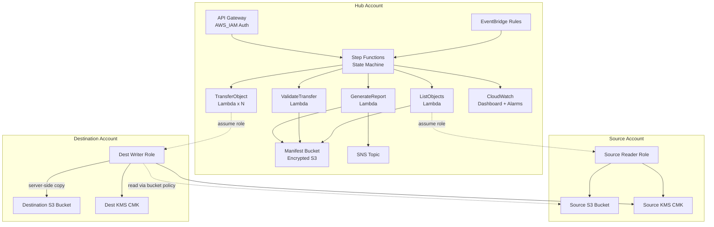
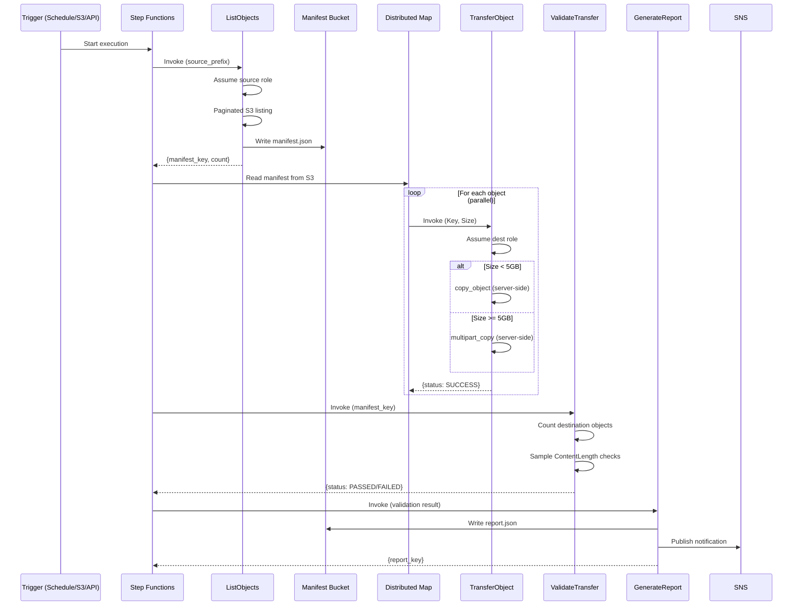
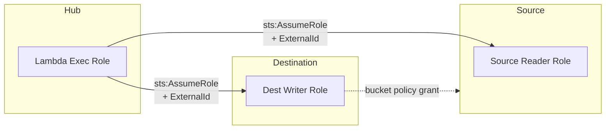

# Architecture

## System Overview

The S3-to-S3 Cross-Account Batch Transfer uses a three-account model with a centralized hub account orchestrating transfers between source and destination accounts.

### Architecture Diagram

### Workflow Sequence

## Security Model

### IAM Trust Relationships

### Defense in Depth

| Layer | Control |
|-------|---------|
| **IAM Roles** | Lambda exec role can ONLY assume specific cross-account roles (by ARN). No wildcards. |
| **External ID** | Optional STS external ID prevents confused deputy attacks |
| **KMS** | Both buckets use CMKs. Key policies grant only specific roles, only specific actions |
| **Bucket Policies** | Source bucket grants read to dest role only. Deny insecure transport. |
| **API Gateway** | AWS_IAM (SigV4) auth only - no API keys, no open endpoints |
| **Manifest Bucket** | Encrypted, versioned, lifecycle-managed, public access blocked |
| **Lambda** | ReservedConcurrentExecutions caps blast radius. X-Ray tracing enabled |
| **Step Functions** | CloudWatch logging at ALL level with execution data |

### Copy Mechanism

No data flows through Lambda. The `TransferObject` Lambda assumes the **destination account role** which has:
- Write on destination bucket (native to the account)
- Read on source bucket (via bucket policy grant)
- KMS Encrypt on destination CMK
- KMS Decrypt on source CMK (via key policy grant)

The actual data transfer is a server-side copy within AWS infrastructure.

## Scalability

- **Distributed Map** processes objects in parallel (configurable `MaxConcurrency`, default 40)
- **Multipart copy** for objects >= 5GB with 100MB parts
- **ReservedConcurrentExecutions** on TransferObject Lambda prevents account-level throttling
- **Manifest stored in S3** (not passed inline) supports millions of objects
- Step Functions can handle up to 10M items per Distributed Map execution

## Retry Strategy

| Error Type | Lambda Retries | SFN Retries | Total Max |
|------------|---------------|-------------|-----------|
| S3 Throttling (SlowDown) | 5 (1-60s jitter) | 8 (5s base, 2.5x backoff) | 13 |
| Lambda Service Error | 0 | 3 (2s base, 2x backoff) | 3 |
| Access Denied | 0 | 0 | 0 (NonRetryableError) |

All retries use `JitterStrategy: FULL` to prevent thundering herd.
